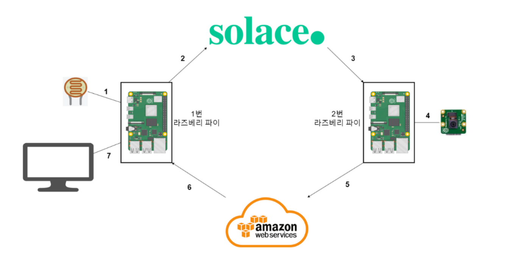

# Ajou IoT system assignment


Device 1 measures the light level and publish to Solace, While subscribed to AWS. 

Device 2 is subscribe to solace. Whenever Device 2 receive the light level by solace it checks if the light level cross certain threshold.

If the threshold is crossed takes a picture and publish it to AWS.

Device 1 then receives the picture and store it. 


## How to Run
### Create Configuration Json for each device
#### solace configuration
```
{
    "Username": "solace-cloud-client",
    "Password": "[your_password]",
    "Secured MQTT Host": "ssl://[hostname].messaging.solace.cloud:8883"
}
```
#### aws configuration
```
{
    "Thing_Name":"[your_name]",
    "Host_Name":"[your_host_name]",
    "Root_CA":"[your AmazonRootCA1.crt path]",
    "Private_Key":"[your .pem.key path]",
    "Cert_File":"[your certificate.pem.crt] path"
}
```
### Set Configuration as you like by editing device_1.py device_2.py file

### Finally for device 1 Run file to begin
```
cd src
python device_1.py
```

### Finally for device 2 Run file to begin
```
cd src
python device_2.py
```
